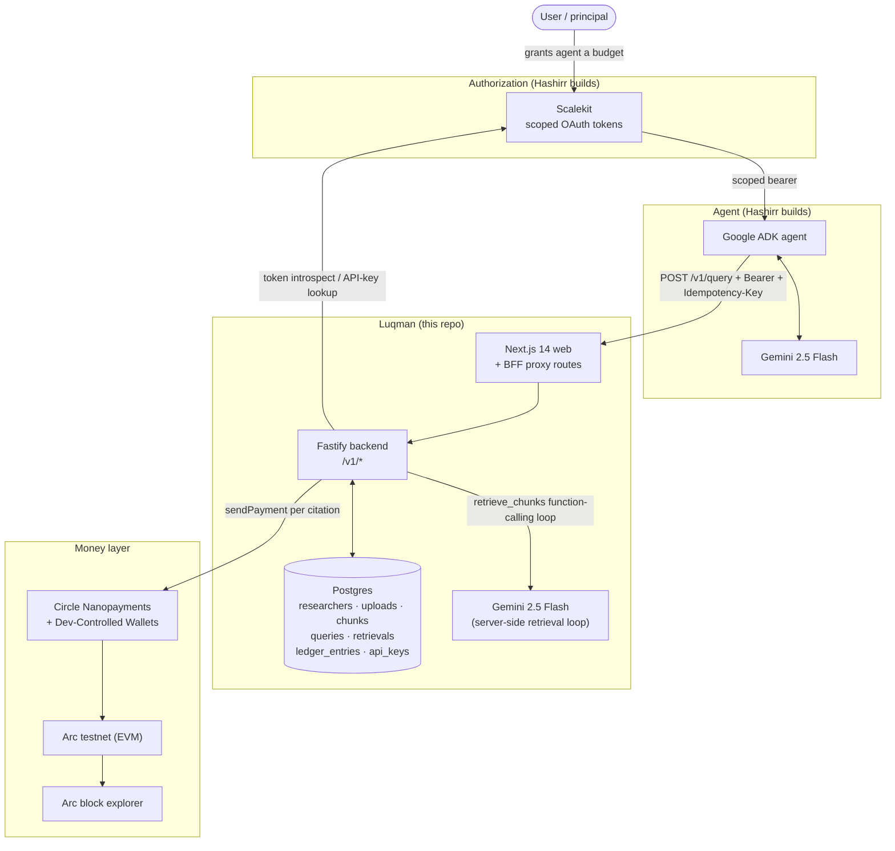
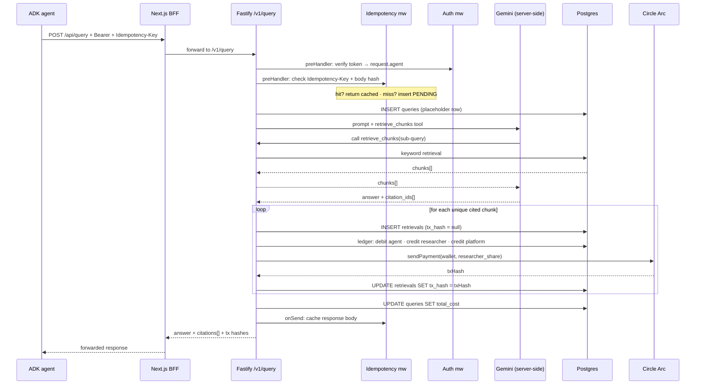

# Luqman — Architecture & Systems Design

> **Audience:** Hashirr + reviewers. For the ZK / Dark Knowledge path that will
> land with the Zeko Labs collaboration, see
> [ARCHITECTURE_ZEKO_NOTES.md](./ARCHITECTURE_ZEKO_NOTES.md).

## 1. Layer map

Each layer does one job. The Luqman backend is the only place they rendezvous.

| Layer                    | Service                               | Job                                                        | Status         |
| ------------------------ | ------------------------------------- | ---------------------------------------------------------- | -------------- |
| User → agent auth        | Scalekit                              | Issues scoped bearer tokens: `max_spend`, `allowed_tiers`  | **Hashirr**    |
| Agent runtime            | Google ADK + Gemini 2.5 Flash         | Reasoning + function calling                               | **Hashirr**    |
| Orchestration            | Fastify + Drizzle + Postgres          | Retrieval, ledger, scope enforcement                       | built          |
| Server-side reasoning    | Gemini 2.5 Flash (function-calling)   | `retrieve_chunks` loop inside `/v1/query`                  | built          |
| Money settlement         | Circle Arc + Nanopayments             | Sub-cent USDC transfers, block-explorer verifiable         | built          |
| Identity / anti-bias     | Zeko (Mina L2) + o1js                 | ZK credential commitments for Dark Knowledge tier          | *future*       |

`built` = implemented in this repo. `Hashirr` = user will implement
himself. `future` = out of scope until the Zeko collaboration resumes.

## 2. System topology



## 3. Query-time sequence (the hot path)



## 4. Step-by-step narrative

1. Agent posts a query to the Next.js BFF (`/api/query`), which transparently
   forwards to the Fastify `/v1/query` endpoint. The BFF exists so the browser
   never needs to know the API origin (no CORS drama).
2. Auth middleware (currently `apiKey.ts`, swapped for a Scalekit variant
   later) verifies the token and attaches `request.agent`.
3. Idempotency middleware enforces the `Idempotency-Key` header. (Full
   implementation is **LEARN #2** — Hashirr to complete.)
4. The handler inserts a placeholder `queries` row so every retrieval can
   reference a query ID even if the request dies mid-flight.
5. The Gemini function-calling loop runs: Gemini is given one tool,
   `retrieve_chunks`, and decides when to stop. This is where "agent-like"
   reasoning actually happens, server-side.
6. For each unique cited chunk, the handler writes a `retrievals` row, fires
   the ledger (**LEARN #1** — wrap in `db.transaction` + invariant assertion),
   sends a Circle Nanopayment, and persists the tx hash back onto the row.
7. Total cost is written to the `queries` row, idempotency cache is
   populated, and the response comes back with every citation's tx hash +
   block-explorer URL.

## 5. Systems-design decisions

### 5.1 Monorepo with pnpm workspaces
Shared types between backend, frontend, and contracts ABI need to move together or you get runtime type mismatches. pnpm workspaces + turbo give one `pnpm install`, one `pnpm dev`, and per-package boundaries.

### 5.2 Fastify over Express
Fastify has a first-class plugin system (needed for idempotency + auth preHandlers), built-in JSON schema validation, and ~3× the throughput of Express. For a demo that fires 50+ txs in ≤3 min, latency matters.

### 5.3 Drizzle over Prisma
Drizzle compiles to SQL you can read; Prisma's query engine is a black box the ledger invariant test cannot easily reason about. The money layer must be legible.

### 5.4 `/v1/*` prefix on every public route
`/v1/query`, `/v1/researchers`, `/v1/earnings/:id`, `/v1/agents/register`. Unversioned routes age badly. Cutting a `/v2` later without breaking in-flight agents is free if we version from day one. `/health` stays unversioned by convention.

### 5.5 Double-entry ledger as source of truth (LEARN #1)
The chain is **eventually consistent** for our purposes — tx confirmation is asynchronous. If we treated on-chain events as the source of truth, a partially-failed query would leak money.

- Ledger row is written **first**, inside one Postgres transaction.
- On-chain settlement is attempted **after** the ledger commits.
- Reconciliation (out of scope for hackathon, documented in code) would flip `tx_hash` back to null and retry if the chain broadcast fails.
- **Invariant:** `SUM(debits) - SUM(credits) = 0` for every transaction scope.

Money is stored as `numeric(18,6)` strings, never JS `number`. JS IEEE-754 cannot represent 0.008 exactly.

### 5.6 Idempotency at the business layer (LEARN #2)
Network-layer retries (LB, proxy) can double-submit a POST. Correct defense is a business-layer idempotency key:

- **First request:** insert a PENDING row keyed by `Idempotency-Key` + body hash, run the handler, upsert COMPLETED with the response body.
- **Duplicate same key + same body:** return cached response, skip handler.
- **Same key + different body:** 409 Conflict.
- **Key still PENDING:** 409 Conflict (prevents double-spend).
- **Handler throws:** do NOT cache. Row stays PENDING and expires; retries allowed.

Canonical Stripe / Airbnb pattern.

### 5.7 Chunk as the billable unit
A "query" is too coarse — different queries touch different amounts of IP. A whole "paper" is too coarse — agents often need one section. ~500 tokens ≈ one semantically-coherent slice ≈ the smallest unit we can reasonably price, and survives Circle's ≤$0.01 nanopayment ceiling.

### 5.8 Keyword retrieval (Level 1) instead of embeddings
The hackathon explicitly permits Level 1 retrieval. Vector embeddings are a multi-day project on their own (pgvector, embedding model, chunk re-indexing). Deterministic keyword overlap also makes the demo **reproducible**: same query → same chunks → same 50+ on-chain txs → recordable video.

### 5.9 Checks-Effects-Interactions + ReentrancyGuard (LEARN #3)
Any contract that moves funds externally is a reentrancy target. Pattern: validate inputs → mutate storage → *then* make external calls. `ReentrancyGuard` is belt-and-braces.

### 5.10 Function Calling as the server-side agent boundary
The server-side Gemini loop gets exactly **one** tool: `retrieve_chunks`. The model decides how many times to call, with what sub-queries, when to stop. This is visibly "agentic" for the demo AND it's the right architectural boundary: the retrieval service never sees free-text reasoning, only structured calls.

Note: this is **not** the "agent" Hashirr is building with ADK. That agent runs on the client side, hits `/v1/query`, and is the surface Scalekit's bearer authorizes. The server-side Gemini loop is a retrieval reasoner, not an agent.

### 5.11 Circle Developer-Controlled Wallets (not end-user wallets)
Researchers in the demo are simulated personae. We own the keys. Real production would use end-user-controlled wallets, but the Circle API surface is identical — we're building the right primitives, just with a simpler custody model for the hackathon.

### 5.12 Three LEARN stubs, not shipped incomplete
Three files intentionally ship as stubs with runnable scaffolding around them: [ledger.ts](apps/api/src/services/ledger.ts), [idempotency.ts](apps/api/src/middleware/idempotency.ts), [LuqmanAttribution.sol](packages/contracts/src/LuqmanAttribution.sol). Each has a detailed TODO block describing the contract to satisfy. Filling these in is the learning scope for the hackathon.

## 6. File-level responsibility map

| File                                              | Responsibility                              | Who builds            |
| ------------------------------------------------- | ------------------------------------------- | --------------------- |
| `apps/api/src/index.ts`                           | Fastify bootstrap + /v1 prefix              | built                 |
| `apps/api/src/routes/query.ts`                    | POST /v1/query handler                      | built                 |
| `apps/api/src/services/gemini.ts`                 | Server-side function-calling loop           | built                 |
| `apps/api/src/services/retrieval.ts`              | Keyword search                              | built                 |
| `apps/api/src/services/attribution.ts`            | 85/15 split math (decimal.js ROUND_DOWN)    | built                 |
| `apps/api/src/services/nanopayments.ts`           | Circle Nanopayments wrapper                 | built                 |
| `apps/api/src/services/circle-wallets.ts`         | Circle Developer-Controlled Wallets wrapper | built                 |
| `apps/api/src/middleware/apiKey.ts`               | X-API-Key auth (Scalekit seam documented)   | built — swap later    |
| **`apps/api/src/services/ledger.ts`**             | **Double-entry core**                       | **Hashirr — LEARN #1** |
| **`apps/api/src/middleware/idempotency.ts`**      | **Idempotency plugin**                      | **Hashirr — LEARN #2** |
| **`packages/contracts/src/LuqmanAttribution.sol`**| **Attribution contract**                    | **Hashirr — LEARN #3** |
| *`apps/api/src/middleware/scalekit.ts`*           | *Scalekit bearer + scope extraction*        | *Hashirr*             |
| *ADK agent client*                                | *Client-side ADK + Gemini agent*            | *Hashirr*             |

## 7. Where Scalekit plugs in

[`apps/api/src/middleware/apiKey.ts`](apps/api/src/middleware/apiKey.ts) carries a block-comment seam describing exactly how to swap the sha256 API-key lookup for Scalekit token introspection while preserving the `request.agent` shape downstream handlers rely on. No route needs to change; only the middleware does.

Scope claims carried in the Scalekit token (proposed):

```jsonc
{
  "sub": "agent_01H9...",
  "aud": "luqman-api",
  "max_spend_usdc": "5.00",
  "allowed_tiers": ["open", "validated"],
  "max_queries": 100,
  "max_chunks_per_query": 20,
  "exp": 1713913200
}
```

In [`routes/query.ts`](apps/api/src/routes/query.ts), after the existing auth check, enforce:

- `estimatedMax <= scope.max_spend_usdc`
- `chunk.tier ∈ scope.allowed_tiers`
- `agent rolling query count ≤ scope.max_queries`

Rejections return 403 and are logged as a ledger-neutral event (zero payment).

## 8. Testing strategy

- **Ledger invariant test** — 500 concurrent `recordRetrievalPayout` calls; sum of debits must equal sum of credits. Catches race conditions and floating-point drift.
- **Idempotency test** — same key twice → one handler execution, same body. Different body with same key → 409.
- **Contract tests (Foundry)** — `vm.expectEmit` on `RetrievalRecorded`; `vm.expectRevert` on unregistered researcher; reentrancy attacker cannot drain funds; rounding crumb accumulates to the platform.
- **End-to-end demo** — `scripts/demo-run.ts` runs 15 queries and asserts ≥50 tx hashes come back non-null.
